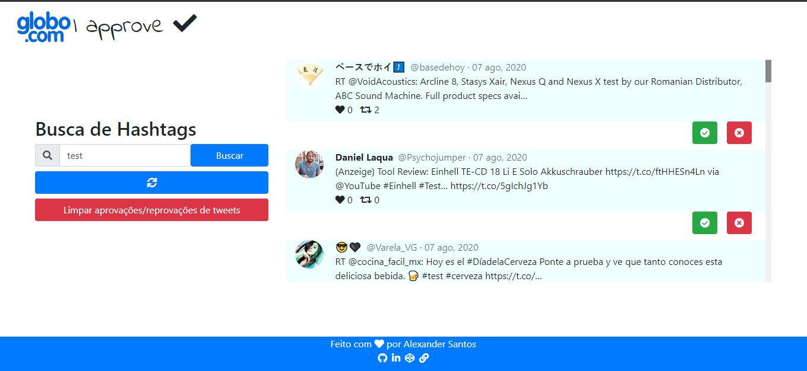
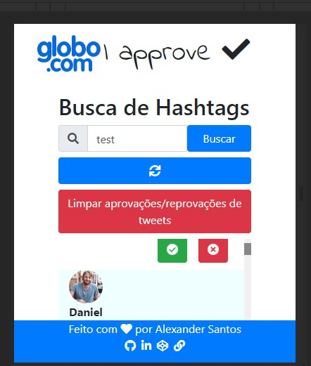

# Twitter IApprove!

Este software foi construido para um teste específico.

Segue o enunciado do teste:

> "Um diretor de TV precisa exibir em um telão, os tweets que chegam contendo uma determinada hashtag que varia diariamente. Foi pedido que esses tweets fossem inseridos no telão por um controle (sistema web) que seria comandado pelo pessoal de operações do estúdio, neste caso o mesmo deveria aprovar os tweets que estão chegando para que o mesmo seja exibido no telão."

* Você pode:

[Ler sobre o frontend](./twitter-iapprove-client/README.md)

[Ler sobre o frontend](./twitter-iapprove-client/README.md)

# Executar a aplicação

Simplesmente execute o arquivo `execute` correspondente ao seu sistema.

* Windows: `execute.bat`
* Linux: `execute.sh`