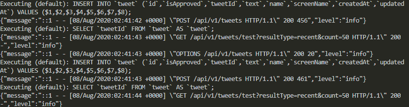

# API

Aqui temos a API do software. Ela é a responsável por todo back-end.

[Clique aqui para ler sobre as tecnologias que utilizei para montar a API](ABOUT.md)



# Instalação

Instale os scripts do node disponíveis no `package.json`

```
npm i
```

Altere o arquivo `.env`([Mais informações](https://www.ibm.com/support/knowledgecenter/ssw_aix_72/osmanagement/env_file.html)) conforme o desejado. Disponibilizei um arquivo `.env` de exemplo para facilitar futuras configurações.

# Execução

Execute o arquivo execute na raíz do projeto

<p align="center">
    
</p>

# Executando testes

```
npm test
```

Irá executar o **mocha**, que executará a suíte de testes.

[Retornar à raiz](../README.md)